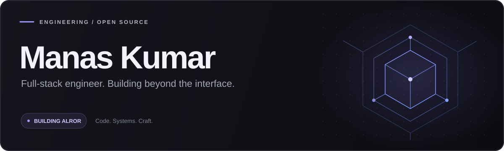
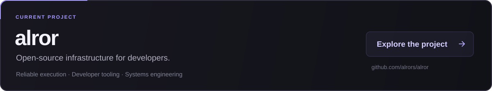
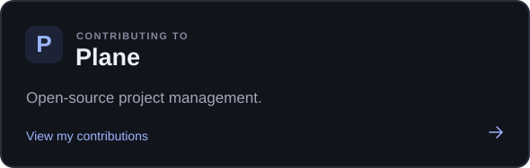
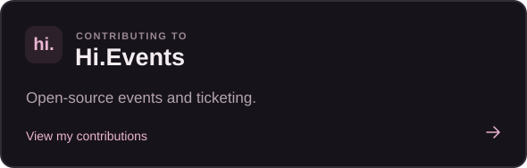

<picture>
  <source media="(max-width: 600px)" srcset="./assets/profile-banner-mobile.svg">
  
</picture>

[Website](https://manaskumar.in) &nbsp;&middot;&nbsp; [LinkedIn](https://linkedin.com/in/manaskumar3003) &nbsp;&middot;&nbsp; [X](https://x.com/ManasKumar3003)

### Currently building

<a href="https://github.com/alrors/alror"><picture><source media="(max-width: 600px)" srcset="./assets/alror-mobile.svg"></picture></a>

I'm building Alror with a focus on reliable execution and practical developer tools. Follow the work at **[alrors/alror](https://github.com/alrors/alror)** or visit **[alror.com](https://alror.com)**.

### Contributing to

 

Working on **[Plane](https://plane.so)** and **[Hi.Events](https://hi.events)** alongside building my own projects.

### My toolkit

`TypeScript` `Go` `Java` `Python` &nbsp; / &nbsp; `React` `Next.js` `Node.js` `PostgreSQL` `Redis` `Docker` `Linux` &nbsp; / &nbsp; `Tailwind CSS`

---

Interested in open source, backend engineering, or developer infrastructure? <a href="https://linkedin.com/in/manaskumar3003">Let's connect.</a>
